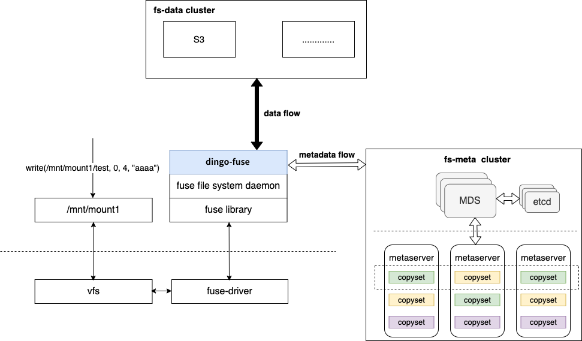
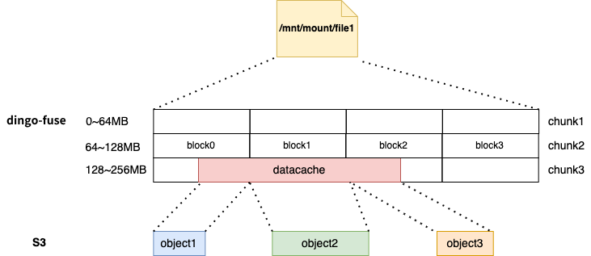

# DingoFS Architecture

DingoFS is a POSIX-compliant distributed file storage system to better support cloud-native scenarios.

## 1.Overall Architecture

DingoFS consists of three parts: 
- `dingo-fuse` is a fuse-based file system client.
    - It receives and handles fuse requests, interacts with `fs-meta cluster` for metadata additions, deletions, and modifications, and interacts with `fs-data cluster` for data additions, deletions, and modifications;
    - Provides metadata caching and data caching to improve performance;
    - Users can access different file system instances through the client.
- `fs-meta cluster` is the metadata service cluster of DingoFS.
    - Its architecture consists of two parts: MDS and Metaserver, which are highly scalable and highly available;
    - mds is used to manage cluster topology, cluster scheduling, file system instances, and file metadata slice management; based on etcd, it stores cluster topology, user and file system information; based on etcd, it realizes the high availability of mds.
    - The metaserver is used to store the metadata (inode and dentry) of the files, and achieves high availability and high reliability through multi-raft. Each raft replica group manages multiple sets of metadata slices. 3.
- `fs-data cluster` is the data service cluster of DingoFS.
    - It currently supports object storage with S3 standard interface;
    - Users can configure it flexibly according to performance scenarios;
    - Because it supports multiple storage clusters, DingoFS metadata is managed in a separate cluster.

## 2.Metadata Cluster

The metadata cluster `fs-meta cluster` is as follows:

**Management Topology**

MDS manages the topology of the meta data cluster as follows: 

- `pool` A physical pool that physically isolates machine resources. A `server` cannot interact across a `pool`;

- `zone` The basic unit of fault isolation, where machines belonging to different `zones` are deployed in different racks and `server` is attributed to a `zone`;

- `server` Physical server, `metaserver` is attributed to a `zone`;

- The `metaserver` minimal service unit, which manages a physical disk.

**Examples of managed document systems**

MDS manages the distribution of file system instances and file system metadata.
- A file system instance consists of multiple metadata `partitions`.
- Each `partition` manages a specified range of inodes, with the inode in the root directory of the file system fixed at 1.
    - Each `partition` manages a specified range of inodes. The inode of the root directory is fixed at 1.
    - For the file /A/B
        - For files /A/B, first find the metadata slice of the root directory and query dentry(/A) on that metadata slice;
        - Get the inodeid of /A from dentry(/A), get the corresponding metadata slice according to the inodeid and query dentry(/A/B);
        - Get the inodeid of /A/B from dentry(/A/B), so as to locate the metadata partition and get the inode information of /A/B.
- The `partition` is managed by `copyset`, which is the craft replication group
    - `copyset` and `partition` have a one-to-many relationship;
    - Both `copyset` and `partition` are dynamically created and can be elastically scaled. The current creation strategy is relatively simple: under the premise that multiple copies of `copyset` are in different `servers`, the `metaserver` is selected according to the remaining capacity of the `metaserver`'s management disks; the `partition` is similarly selected according to the remaining capacity of the `metaserver` where the `copyset` is located;

**MDS High Availability**

MDS high availability is implemented based on etcd, allowing some instances to be exceptionally available, as shown in the following figure:

MDS registers with etcd, while only one MDS provides service, the backup MDS listens. When the primary MDS hangs up, the backup MDS starts to provide service.

**Metaserver High Availability**

Metaserver high availability is based on raft implementation, 2N+1 replicas allow N replicas exception.

## 3.Data organization form 
`fs-data cluster` stores the actual data of the file, it can be an object storage cluster that supports S3 standard protocol, and we will dock more clusters according to the scenario requirements.

### Docking S3 
For a file in the file system, the correspondence between the address space and the S3 object is shown below:

- On the `dingo-fuse` side, a file's address space consists of multiple fixed-size `chunks`, each of which consists of multiple `datacache`s of variable length;
- The `datacache` is split according to the granularity of the `block` and uploaded to S3;
- Each datacache is represented by { chunkid, offset, len, size } in inode, and the key of each datacache in S3 is represented by { fsid, inodeid, chunkid, blockindex }. According to the record of data position in inode, we can calculate the number of data blocks in S3 corresponding to this part of data and the key of each data block by the size of `chunk` and `block`.

## 4.System Features
1. Multi-storage system support. Data is supported to be stored both to the public cloud and to local storage systems; it supports free flow of data between different storage systems and active/passive data lifecycle management;
2. metadata clusters and data clusters are highly available, highly scalable, and highly reliable;
3. support for cache, the client has two levels of memory and disk cache acceleration; support for multi-level cache, BS clusters can be used as a persistent cache layer ;)
4. POSIX-compatible, used like a local file system, business can be seamlessly accessed;
5. Easy operation and maintenance , common exceptions can be self-healing.
