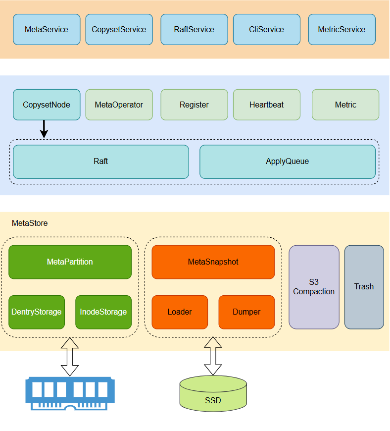
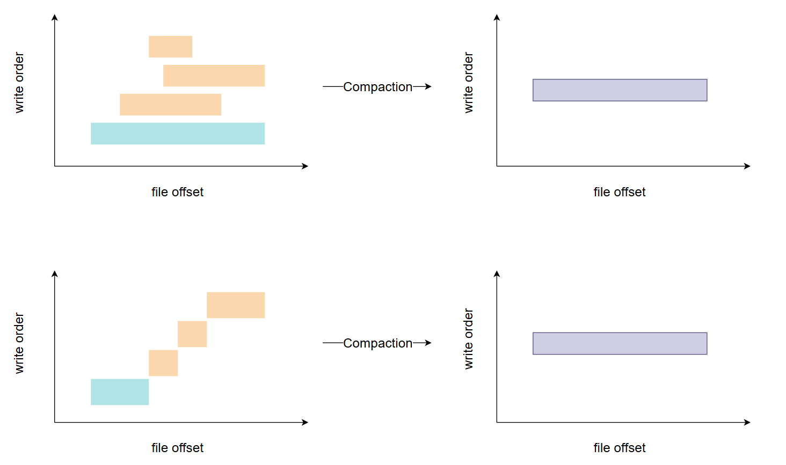

# MetaServer Architecture
## Overview

MetaServer provides highly available and reliable metadata services in a DingoFS cluster and guarantees file system metadata consistency. At the same time, it was designed with high performance and scalability in mind.

In the overall design, a single MetaServer runs on the host as a user process, and a host can run multiple MetaServer processes if there are enough CPU/RAM resources. At the same time, Raft is utilized to ensure data consistency and high availability of services.

At the metadata management level, file system metadata is managed in slices to avoid the performance bottleneck caused by a single Raft Group maintaining a file system metadata. Each slice of metadata is called a Partition, and the correspondence between Copyset and Partition can be one-to-one or one-to-many. In the one-to-many case, a Copyset can maintain multiple Partitions. in the one-to-many case, the file system metadata management is shown in the following figure:

There are two Copysets in the figure, and three copies are placed on three machines.P1/P2/P3/P4 denote the metadata partitions of the file system, where P1/P3 belongs to one file system and P2/P4 belongs to one file system.

## Overall Architecture

The overall architecture of MetaServer is shown below, which can be roughly divided into three parts: Service Layer, Core Business Layer and MetaStore, which collaborate with each other to efficiently handle various requests and tasks from external components. The following is a detailed description of each module.

### Service Layer

Provides an RPC interface to other services (Dingo-Fuse, MDS, MetaServer, etc.) in the system. It also provides a RESTful interface to synchronize the state (Metric) of components in the current process to Prometheus.

#### MetaService

MetaService is the core service of MetaServer, which provides necessary interfaces for file system metadata query, creation, update and deletion operations, such as CreateInode, CreateDentry, ListDentry, and supports dynamic creation and deletion of Partitions.

#### CopysetService

Provides interfaces for dynamically creating Copyset and querying Copyset status. When creating a file system, MDS will decide whether to create a new Copyset according to the current load of the cluster.

#### RaftService

Provided by [braft](https://github.com/baidu/braft) for Raft Consistency Protocol interactions.

#### CliService (Command Line Service)

Provides interfaces for Raft configuration changes, including AddPeer, RemovePeer, ChangePeer, TransferLeader, and an additional GetLeader interface to get the latest leader information for the current replication group.

#### MetricService

Provides a RESTful interface to get the state of each component of the process, which Prometheus calls to collect data and display it visually using Grafana.

### Core Business Layer

MetaServer core processing logic, including the processing of metadata requests and ensuring metadata consistency, high availability, and high reliability; heartbeat reporting and configuration change task execution processing; and registration module.

#### CopysetNode

Represents a copy in a Raft Group, which is a simple encapsulation of a braft raft node and implements a Raft state machine.

#### ApplyQueue

Used to isolate braft apply thread, the request that can be applied will be put into ApplyQueue, meanwhile, ApplyQueue guarantees the orderly execution of the request, and returns the response to the client after the request is executed.

#### MetaOperator

When a metadata request arrives, a corresponding operator will be generated. The operator will encapsulate the request into a task, and then hand it over to the CopysetNode corresponding to the metadata request for processing, so as to complete the synchronization of data between replicas.

#### Register

The normal cluster startup process is to start the MDS first, then create the logical pool, and finally start the MetaServer. when creating the logical pool, you need to specify the topology of the logical pool, as well as the IPs and ports of the MetaServer processes. the purpose of doing so is to prevent illegal MetaServers from joining the cluster.

The purpose of this is to prevent unauthorized MetaServers from joining the cluster. Therefore, during the startup phase of the MetaServer, you need to register with the MDS, and the MDS will return a unique MetaServerID and Token, which you will need to provide as an identity and authentication information when the MetaServer communicates with the MDS in the following phases.

#### Heartbeat

MDS needs real-time information to confirm the online status of MetaServer, get the status and statistics of MetaServer and Copyset, and calculate whether the current cluster needs dynamic scheduling and corresponding scheduling commands based on the information of all MetaServers.

MetaServer accomplishes the above functions by heartbeat, reporting the information of MetaServer and Copyset through periodic heartbeats, and executing the scheduling tasks in the heartbeat response.

#### Metric

Use [bvar](https://github.com/apache/incubator-brpc/blob/master/docs/en/bvar.md) to export the statistics of core modules in the system.

### MetaStore

Efficiently organizes and manages in-memory metadata, and works with Raft to periodically dump metadata to speed up the reboot process.

#### MetaPartition

The metadata of the file system is managed in partitions, each partition is called Partition, which provides an interface for adding, deleting, modifying, and checking Dentry and Inode by aggregating InodeStorage and DentryStorage, meanwhile, the metadata managed by Partition are all cached in the memory.

Inode corresponds to a file or a directory in the file system and records the corresponding metadata information, such as atime/ctime/mtime. When an Inode represents a file, it also records the data addressing information of the file. Each Partition manages a fixed range of Inodes, which are divided according to InodeId, for example, InodeId [1-200] is managed by Partition 1, InodeId [201-400] is managed by Partition 2, and so on.

Dentry is a directory entry in the file system that records the mapping of file names to inodes. Dentry information for all files/directories under a parent directory is managed by the Partition in which the parent inode resides.

#### MetaSnapshot

Raft snapshots are implemented in conjunction with CopysetNode to periodically dump metadata information recorded in a MetaPartition to the local disk, which serves the functions of startup acceleration and metadata de-duplication.

When a Raft snapshot is triggered, MetaStore will fork a child process, which will serialize and persist all metadata recorded in the current MetaPartition to local disk. When the process is restarted, the last Raft snapshot is first loaded into the MetaPartition, and then the metadata operations are played back from the Raft log.

#### S3Compaction

When docking to an S3 file system (file system data is stored in S3), since most S3 services do not support overwrite/append writes to objects, when writing to a file as described above, Dingo-Fuse will upload the newly-written data to a new S3 object and insert a corresponding record into the extent field of the Inode.

Take the following figure as an example, after the user writes the file for the first time, three overwrite writes are performed, so four records will be recorded in the extent field. In the absence of Compaction, subsequent read operations need to calculate the latest data for each extent, then download and merge them from S3, and finally return them to the upper application. The performance overhead and waste of space is obvious, but there is no way to limit the write pattern of the upper tier application.

The main purpose of Compaction is to merge overlapping or consecutive writes in the extent to generate a new S3 object to speed up subsequent reads and reduce wasted storage space.

#### Trash

In the current design, when the nlink count of an Inode is reduced to 0, the Inode is not cleaned up immediately, but the Inode is marked as pending cleanup, and will be scanned by the Trash module periodically, and the Inode will be deleted from the MetaPartition only when it exceeds the preset threshold time.