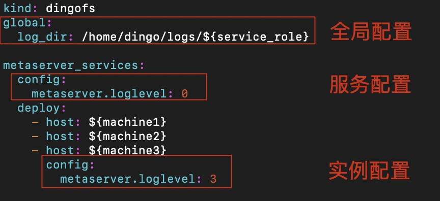

Cluster Topology File
===

Introduction
---

The cluster topology file is used to describe which services are deployed on which machines, as well as the configuration of each service instance.

Example
---

```yaml
kind: dingofs
global:
  container_image: dingodatabase/dingofs:latest
  data_dir: /home/dingofs/data/${service_role}
  log_dir: /home/dingofs/logs/${service_role}

etcd_services:
  config:
    listen.ip: ${service_host}
    listen.port: 2380
    listen.client_port: 2379
  deploy:
    - host: server-host1
    - host: server-host2
    - host: server-host3

mds_services:
  config:
    listen.ip: ${service_host}
    listen.port: 6700
    listen.dummy_port: 7700
  deploy:
    - host: server-host1
    - host: server-host2
    - host: server-host3

metaserver_services:
  config:
    listen.ip: ${service_host}
    listen.port: 6800
    metaserver.loglevel: 0
  deploy:
    - host: server-host1
    - host: server-host2
    - host: server-host3
      config:
        metaserver.loglevel: 3
```

Features
---

To make topology file configuration more flexible and concise, we have added the following features to the topology file:

* [Hierarchy](#Hierarchy)
* [Variables](#Variables)
* [Replica](#Replica)

<a id="Hierarchy"></a>
### Hierarchy

The configuration in the topology file is divided into the following 3 levels:
* Global configuration: Applies to all service instances in the topology file
  * Service configuration: Applies to all service instances under the same role
  * Instance configuration: Applies to a single service instance

The configuration priority is: `Instance configuration` > `Service configuration` > `Global configuration`.



#### Example: Simplifying topology files using configuration levels

The following are two different configuration files, but they have the same configuration effect:

```yaml
mds_services:
  config:
  deploy:
    - host: server-host1
      config:
        leader.electionTimeoutMs: 3
    - host: server-host2
      config:
        leader.electionTimeoutMs: 3
    - host: server-host3
      config:
        leader.electionTimeoutMs: 3
```

```yaml
mds_services:
  config:
    leader.electionTimeoutMs: 3
  deploy:
    - host: server-host1
    - host: server-host2
    - host: server-host3
```

<a id="Variables"></a>
### Variables

To reduce repetitive configuration and simplify the topology file, we have built-in the following variables,
which have different values in different contexts and can be used to fill in the topology file configuration:

| Variable Name                         | Description                                                                                                                                                                                                                                        | Example                                                        |
| :---                           | :---                                                                                                                                                                                                                                        | :---                                                        |
| `${service_host}`              | Service host address. This variable has different values when deploying services on different hosts. For example, when deploying services on host `server-host1`, the variable value is the address corresponding to host `server-host1`, i.e., `10.0.1.1`. When deploying services on host `server-host2`, the value of this variable is `10.0.1.2`. For more details, see [Host Module](hosts) | `10.0.1.1`                                                  |
| `${service_role}`              | Service role name. When deploying different types of services, they have different role names. For example, when deploying the etcd service, the variable value is etcd, and when deploying the mds service, the variable value is mds                                                                                                          | `etcd`, `mds`, `chunkserver`, `snapshotclone`, `metaserver` |
| `${service_host_sequence}`     | Service host sequence number. When deploying services of the same type, based on the `deploy` list, the sequence number is 0 when deploying the service on the first host, 1 when deploying on the second host, and so on.                                                                                              | `0`, `1`, `2`                                               |
| `${service_replicas_sequence}` | Service replica sequence number. When deploying multiple replica instances of the same service type on the same host, the sequence number is 0 for the first replica, 1 for the second replica, and so on. | `0`, `1`, `2` |
| `${format_replicas_sequence}` | Formatted service replica sequence number. Its value is equivalent to the `${service_replicas_sequence}` variable, but the sequence number is prefixed with 0 | `00`, `01`, `02` |
| `${random_uuid}`               | Random UUID                                                                                                                                                                                                                                   | `6fa8f01c411d7655d0354125c36847bb`                          |

Currently, in addition to built-in variables, users can also define custom variables by adding them to the `variable` block:

```yaml
global:
  variable:
    var1: value1
    var2: value2
```

Below, we will demonstrate the application of variables through three examples. Each example has two different configurations, but they all achieve the same configuration effect:

> We assume that the addresses corresponding to server-host{1,2,3} are 10.0.1.{1,2,3}, and they have been submitted via the [Host Module][hosts]

#### Example 1: Deploying an etcd instance on each host

```shell
etcd_services:
  config:
  deploy:
    - host: server-host1
      config:
        listen.ip: 10.0.1.1
    - host: server-host2
      config:
        listen.ip: 10.0.1.2
    - host: serevr-host3
      config:
        listen.ip: 10.0.1.3
```

```yaml
etcd_services:
  config:
    listen.ip: ${service_host}
  deploy:
    - host: server-host1
    - host: server-host2
    - host: server-host3
```

#### Example 2: Deploying multiple chunkserver instances on the same host

```yaml
chunkserver_services:
  config:
    listen.ip: 10.0.1.1
  deploy:
    - host: serevr-host1
      config:
        listen.port: 8200
    - host: serevr-host2
      config:
        listen.port: 8201
    - host: server-host3
      config:
        listen.port: 8202
```

```yaml
chunkserver_services:
  config:
    listen.ip: 10.0.1.1
    listen.port: 820${service_host_sequence}
  deploy:
    - host: server-host1
    - host: server-host2
    - host: server-host3
```

#### Example 3: Custom variables

```yaml
etcd_services:
  deploy:
   - host: server-host1
   - host: server-host2
   - host: server-host3

mds_services:
 deploy:
   - host: server-host1
   - host: server-host2
   - host: server-host3
```

```yaml
global:
  variable:
    machine1: server-host1
    machine2: server-host2
    machine3: server-host3

etcd_services:
  deploy:
    - host: ${machine1}
    - host: ${machine2}
    - host: ${machine3}

mds_services:
  deploy:
    - host: ${machine1}
    - host: ${machine2}
    - host: ${machine3}
```

<a id="Replica"></a>
### Replica

> 💡 **Reminder:**
>
> The replicas here do not represent the number of storage pool replicas, but rather the number of instances of the same type of process deployed on the node, such as the number of chunkserver processes.

When we need to deploy multiple instances of the same type of service on a single machine, we can use the `replicas` feature to simplify our topology file:

```yaml
chunkserver_services:
  config:
    listen.port: 820${service_host_sequence}
  deploy:
    - host: server-host1
    - host: server-host1
    - host: server-host1
```

```yaml
chunkserver_services:
  config:
    listen.port: 820${service_replicas_sequence}
  deploy:
    - host: server-host1
      replicas: 3
```

The values of the variables `${servicce_host_sequence}` and `${service_replicas_sequence}` are described in the previous section [Variables](#Variables)

DingoFS Cluster Topology
---

The DingoFS cluster topology file consists of the following 4 blocks:

| Block                | Description                | Service Overview                                                                                                                |
| :---                | :---                | :---                                                                                                                    |
| global              | Global Configuration            |                                                                                                                         |
| etcd_services       | etcd Service Block       | Used to store metadata                                                                                                          |
| mds_services        | mds Service Block        | Metadata Management Service |
| metaserver_services | Metaserver service block | Distributed metadata management system. Provides metadata services to clients. |

### Example

```yaml
kind: dingofs
global:
  container_image: dingodatabase/dingofs:latest
  log_dir: ${home}/dingofs/logs/${service_role}
  data_dir: ${home}/dingofs/data/${service_role}
  variable:
    home: /tmp
    machine1: server-host1
    machine2: server-host2
    machine3: server-host3

etcd_services:
  config:
    listen.ip: ${service_host}
    listen.port: 2380
    listen.client_port: 2379
  deploy:
    - host: ${machine1}
    - host: ${machine2}
    - host: ${machine3}

mds_services:
  config:
    listen.ip: ${service_host}
    listen.port: 6700
    listen.dummy_port: 7700
  deploy:
    - host: ${machine1}
    - host: ${machine2}
    - host: ${machine3}

metaserver_services:
  config:
    listen.ip: ${service_host}
    listen.port: 6800
    listen.external_port: 7800
    metaserver.loglevel: 0
  deploy:
    - host: ${machine1}
    - host: ${machine2}
    - host: ${machine3}
      config:
        metaserver.loglevel: 3
```

To make it easier for users to prepare topology files, we have prepared different topology file templates based on common scenarios.
Users can choose the appropriate template based on their needs and make adjustments as needed:

* [Single-machine deployment][dingofs-stand-alone-topology]

All services run on a single host, typically used for testing or evaluation.

* [Multi-node deployment][dingofs-cluster-topology]

A generic multi-machine deployment template suitable for production environments or testing.

> 💡 **Note:**
>
> For details on configuration levels and variables in topology files, see the previous section:
> * [Hierarchy](#Hierarchy)
> * [Variables](#Variables)

<a id="important-dingofs-configuration-items"></a>
### Important DingoFS Configuration Items

| Configuration Item           | Required | Default Value                         | Description                                                                                                                                 |
| :---             | :---     | :---                           | :---                                                                                                                                 |
| kind             | Y        |                                | Topology file type. Must be `dingofs`                                                                                                       |
| container_image  |          | dingodatabase/dingofs:latest | Container image. The default value is our latest stable version. You can also visit the [DingoFS public Docker repository][dingofs-dockerhub] to select your own                               |
| log_dir          |          |                                | Directory where service logs are stored. If this option is not configured, logs are stored by default in the specified directory within the container. Once the container is cleaned up, the logs will be deleted                               |
| data_dir         |          |                                | Directory where service data is stored. If this option is not configured, data is stored by default in the specified directory within the container. Once the container is cleaned up, the data will be lost                               |
| s3.ak            |          |                                | S3 service Access Key. Used for uploading actual data. Required only when using the S3 storage engine and creating a file system. |
| s3.sk            |          |                                | S3 service Secret Key. Used for uploading actual data. Required only when using the S3 storage engine and creating a file system. |
| s3.endpoint      |          |                                | S3 service address. Used for uploading actual data. Required only when using the S3 storage engine and creating a file system.                                                                                                        |
| s3.bucket_name   |          |                                | S3 service bucket name. Used for uploading actual data. Required only when using the S3 storage engine and creating a file system.                                                                                                        |
| variable         |          |                                | Variable block. Custom variables can be entered in this block. |

All configuration items not specified in the topology file will use default values. You can view the configuration items and default values for each service by clicking the following links:

* [etcd.conf][dingofs-etcd-conf]
* [mds.conf][dingofs-mds-conf]
* [metaserver.conf][dingofs-metaserver-conf]

[hosts]: ./hosts.md
[dingofs-stand-alone-topology]: https://github.com/dingodb/dingoadm/blob/master/configs/fs/stand-alone/topology.yaml
[dingofs-cluster-topology]: https://github.com/dingodb/dingoadm/blob/master/configs/fs/cluster/topology.yaml
[dingofs-dockerhub]: https://hub.docker.com/r/dingodatabase/dingofs/tags
[dingofs-etcd-conf]: https://github.com/dingodb/dingofs/tree/main/conf/etcd.conf
[dingofs-mds-conf]: https://github.com/dingodb/dingofs/tree/main/conf/mds.conf
[dingofs-metaserver-conf]: https://github.com/dingodb/dingofs/tree/main/conf/metaserver.conf