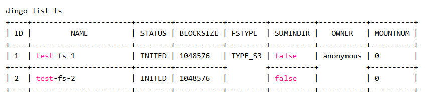

# File System Management
## 1.Create Client Configuration File 
create client.yaml
```
kind: dingofs
s3.ak: < >
s3.sk: < >
s3.endpoint: < >
s3.bucket_name: < >
container_image: dingodatabase/dingofs:latest
mdsOpt.rpcRetryOpt.addrs: 10.0.1.1:6700,10.0.1.2:6700,10.0.1.3:6700
log_dir: /home/dingo/logs/client
data_dir: /home/dingo/data/dingofs
disk_cache.cache_dir: /dingofs/client/cache/1:10240;/dingofs/client/cache/2:10240;/dingofs/client/cache/3:10240  
# container_path:size
mount_dirs: /mnt/cache/1:/dingofs/client/cache/1;/mnt/cache/2:/dingofs/client/cache/2;/mnt/cache/3:/dingofs/client/cache/3  
# host_path:container_path

# cto reference
fs.cto: true
 
# quota
quota.capacity: 10
quota.inodes: 1000
```
The configuration items in the client configuration file have the same meaning as the configuration items in the cluster topology file, see DingoFS Important Configuration Items for details.
For all configuration items that do not appear on the client configuration file, we will use the default configuration values. You can click on the client configuration file to view each configuration item and the associated default values.

💡 About the mdsOpt.rpcRetryOpt.addrs Configuration Item 
Since all the routing information exists in the MDS service, the client only needs to know the address of the MDS service in the cluster in order to read and write to the IO normally.
The mdsOpt.rpcRetryOpt.addrs configuration item in the configuration file needs to be filled in with the address of the MDS service in the cluster. You can check the address of the MDS service in the cluster via dingoadm status after you have deployed the DingoFS cluster:
```
$ dingoadm status
Get Service Status: [OK]

cluster name: my-cluster
cluster kind: dingofs
cluster mds addr: 10.0.1.1:6700,10.0.1.2:6700,10.0.1.3:6700
cluster mds leader: 10.0.1.1:6700 / 505da008b59c
```

📢 Note: 
users must configure the data_dir configuration if they want to enable local disk caching.

📢 Note: 
dingofs supports multiple s3s, one fs corresponds to one s3 backend. All s3 information (ak, sk, endpoint, and bucket_name) is stored in mds, and other components get it from mds. The s3 information in the mds is specified when the fs is created. Therefore, the s3 information in client.yaml is required and will be synchronized to the configuration file of the fs creation tool. If the fs have already been created, please keep the same information, otherwise the mount will fail; if the fs have not been created yet, please make sure the s3 information is available, otherwise the mount will fail.

## 2.Create a File System 
Use dingo tool to create DingoFS file system by specifying the configuration file, you can choose to specify the file system parameters on the command line, or you can configure the parameters into the dingo tool's configuration file dingo.yaml.

- [download dingo.yaml](https://github.com/dingodb/dingofs/blob/main/conf/dingo.yaml)

```
global:
  httpTimeout: 500ms
  rpcTimeout: 500ms
  rpcRetryTimes: 1
  maxChannelSize: 4
  showError: false
 
dingofs:
  mdsAddr: 127.0.0.1:6700,127.0.0.1:6701,127.0.0.1:6702  # __CURVEADM_TEMPLATE__ ${cluster_mds_addr} __CURVEADM_TEMPLATE__
  mdsDummyAddr: 127.0.0.1:7700,127.0.0.1:7701,127.0.0.1:7702  # __CURVEADM_TEMPLATE__ ${cluster_mds_dummy_addr} __CURVEADM_TEMPLATE__
  etcdAddr: 127.0.0.1:23790,127.0.0.1:23791, 127.0.0.1:23792  # __CURVEADM_TEMPLATE__ ${cluster_etcd_addr} __CURVEADM_TEMPLATE__
  s3:
    ak: ak
    sk: sk
    endpoint: http://localhost:9000
    bucketname: bucketname
    blocksize: 4 mib
    chunksize: 64 mib
```

Configure the following fields
- mdsAddr: metadata service address\
- ak: access key for the s3 service\
- sk: secret key for the s3 service\
- endpoint: address of the s3 service\
- bucketname: bucketname used in the s3 service (supplied by the deployer)

Execute the following statement to add the configuration file to the environment variables
```
mv dingo.yaml ~/.dingo/dingo.yaml
```
or
```
export CONF=/opt/dingo.yaml
```
- Execute the create file system statement
```
dingo create fs --fsname myfs
```
- Using the create statement to create a file system\
You can also create a file system directly by adding parameters directly to the create statement.
```
dingo create fs --fsname myfs --fstype s3 --s3.ak access_key --s3.sk secret_key --s3.endpoint http://127.0.0.1:8000 --s3.bucketname test-bucket  --mdsaddr 127.0.0.1:6700,127.0.0.1:6701,127.0.0.1:6702
```
Parameter description
- fsname: file system, user-defined, but must be a combination of lowercase letters, numbers, hyphens, i.e., to satisfy the regular expression ^([a-z0-9]+\\-?) +$\
- fstype: storage service type\
- s3.ak: access key of s3 service\
- s3.sk: s3 service's secret key\
- s3.endpoint: s3 service address\
- s3.bucketname: bucketname used in the s3 service (provided by the deployer)\
- mdsaddr: metadata service address\
💡 More dingo tool features, see dingo tool for details

## 3.Mount the Filesystem 
Use the dingoadm tool to mount the filesystem. if dinofs-name already exists. then first create the filesystem and mount it to the specified directory.
```
$ dingoadm mount <dingofs-name> <mount-point> --host <host> -c client.yaml
```
Parameter description
- dingofs-name: filesystem name, user-defined, but must be a combination of lowercase letters, numbers, hyphens, i.e., meet the regular expression ^([a-z0-9]+\\-?) +$\
- mount-point: mount path, user-defined, but must be an absolute path.
- --host: mount the volume to the specified host, user-defined, please make sure the host has been imported\
- -c: dingofs-name does not exist, use this configuration file to create the filesystem\
If the filesystem is mounted successfully, you can query the corresponding DingoFS filesystem mount entry on the corresponding host:
```
$ mount | grep <mount-point>
```
On the center machine (i.e., the machine where dingoadm is located, users can operate the dingofs service on other machines via the dingoadm command), users can also view the status of all clients:
```
$ dingoadm client status
```
 📢 Note: 
If dingofs needs to use multiple s3 functions, modify the configuration of the s3 information in client.yaml for different fs.
- Example:
```
$ dingoadm mount test /mnt/test --host client-host -c client.yaml
```
## 4.Querying Filesystems 
Use the dingo tool to query existing filesystems.
dingo list fs


## 5.Deleting a File System 
Use the dingo tool to delete an existing file system.
```
dingo delete fs --fsname test1
WARNING:Are you sure to delete fs test1?
please input `test1` to confirm: test1
```

#### Parameter Description
- fsname: The name of the file system to be deleted. After execution, you need to input the file system name again to confirm the deletion, to prevent deleting the file system by mistake.

## Appendix: Important DingoFS Configuration Items 
|Configuration Items |Is Required |Default |Description | 
|------- |--------- |-------- |-------- |
|kind |Y | | Topology File Type. Must be dingofs| 
|container_image| |Dingodatabase/dingofs:latest| container image. The default is our latest stable version, or you can visit the DingoFS public docker repository to choose your own | 
|log_dir| | | directory where service logs are kept. If this option is not configured, the logs are stored in the specified directory within the container and will be deleted once the container is cleaned up | 
|data_dir| | | the directory where the service data is stored. If this option is not configured, the data is saved in the specified directory within the container by default and will be lost if the container is purged |
|s3.ak| | | The Access Key for the S3 service. used to upload the actual data. Required only when using the S3 Storage Engine and creating a file system | 
|s3.sk| | |S3 service's Secret Key. Used to upload the actual data. Required only when using the S3 Storage Engine and creating a file system | 
|s3.endpoint| | |S3 Service Address. Used to upload the actual data. Required only if you are using the S3 Storage Engine and creating a file system | 
|s3.bucket_name|  | |S3 service bucket name. Used to upload the actual data. Required only if using S3 Storage Engine and creating a file system |
|variable | | | Variable block. Custom variables can be populated in the block|