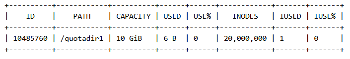
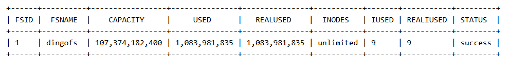
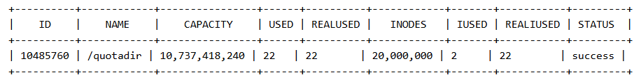
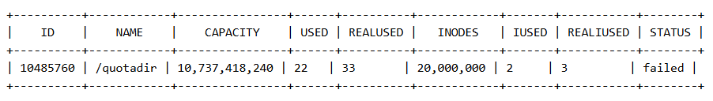

# Quota Basic Operations
Supports setting, querying, and deleting Quota at the file system level and directory level using the dingo tool.
- Filesystem level: The set quota takes effect on the whole filesystem;
- Directory level: Quota can be set for each folder directory individually, and the set quota will take effect for that directory.
## 1.Setting Quota
### File System Level
```
dingo config fs --fsid 1 --capacity 100
dingo config fs --fsname dingofs --capacity 10 --inodes 1000000000
```
Parameter Description 
- fsid: the corresponding id of the file system to be set, you can use the dingo tool to query the id of the file system 
- fsname: the corresponding name of the file system to be set, you can use the dingo tool to query the name of the file system 
- capacity: the maximum space to be used by the file system, unit GBzho 
- inodes: the maximum number of files in the file system

### Catalog Level
```
dingo quota set --fsid 1 --path /quotadir --capacity 10 --inodes 100000
```
Parameters 
- fsid: the corresponding id of the file system to be set, you can use the dingo tool to query the corresponding id of the file system 
- path: the path of the folder where you need to set up the quota, it is a relative path, and "/" stands for the root directory of the file system 
- capacity: the maximum space of the directory to be used, the unit is GB 
- inodes: the maximum number of files in the directory

## 2.Query Quota
### File System Level
```
dingo config get --fsid 1
dingo config get --fsname dingofs
```
Parameter Description 
- fsid: the corresponding id of the file system to be queried, you can use the dingo tool to query the file system id 
- fsname: the corresponding name of the file system to be queried, you can use the dingo tool to query the file system name 
- Query Result:

### Catalog Level
```
dingo quota get --fsid 1 --path /quotadir
dingo quota get --fsname dingofs --path /quotadir
```
Parameters 
- fsid: the corresponding id of the file system to be queried, you can use dingo tool to query the id of the file system 
- fsname: the corresponding name of the file system to be queried, you can use dingo tool to query the name of the file system 
- path: the path of the directory of the folder to be queried, it is a relative path, and "/" stands for the root directory of the file system.
- Query Result


## 3.Delete Quota
### File System Level
将capacity以及inodes设置为0，即为无限制。
```
dingo config fs --fsid 1 --capacity 0 --inodes 0
dingo config fs --fsname dingofs --capacity 0 --inodes 0
```
Parameter Description 
- fsid: the file system corresponding to the id of the file system that needs to delete quota, you can use the dingo tool to query the file system id 
- fsname: the file system corresponding to the name of the file system that needs to be deleted, you can use the dingo tool to query the name of the file system 
- capacity: the maximum space of the file system to be used in GB, 0 is unlimited 
- inodes: the maximum number of files in the file system, 0 is unlimited maximum number of files, 0 is unlimited

### Catalog Level 
Set capacity and inodes to 0, i.e., no limit.
```
dingo quota set --fsid 1 --path / --capacity 0 --inodes 0
```
Parameter description 
- fsid: the corresponding id of the file system where quota needs to be deleted, you can use dingo tool to query the id of the file system 
- path: the path of the folder directory where quota needs to be deleted, it's a relative path, and "/" stands for the root directory of the file system 
- capacity: the maximal space of the file system, unit is GB, and 0 is unlimited 
- inodes: the maximal number of files of file system, and 0 is unlimited inodes: the maximal number of files of file system, and 0 is unlimited maximum number of files, 0 is unlimited
## 4.Calibrate Quota
### File System Level
```
dingo config check --fsid 1
dingo config check --fsname dingofs
```
Parameters 
- fsid: the corresponding id of the file system to be set, you can use the dingo tool to query the corresponding id of the file system 
- path: the path of the folder where you need to set up the quota, it is a relative path, and "/" stands for the root directory of the file system 
- capacity: the maximum space of the directory to be used, the unit is GB 
- inodes: the maximum number of files in the directory

### Catalog Level
```
dingo quota check --fsid 1 --path /quotadir
dingo quota check --fsid 1 --path /quotadir –repair
```
Parameter description:
- fsid: The ID of the file system to be verified. This can be queried using the dingo tool.
- Path: The directory path of the quota to be verified. This is a relative path, where "/" represents the file system root directory.
- repair: If the quota check fails, use the repair parameter to try to synchronise the quota usage.
- Verification results:
Successfully verified

Failed
