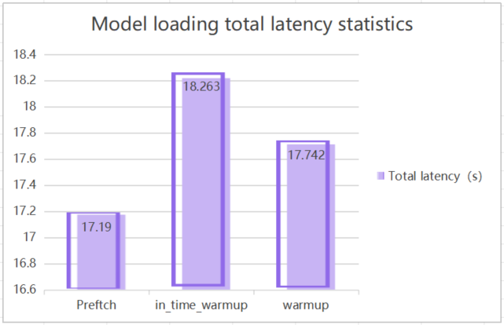
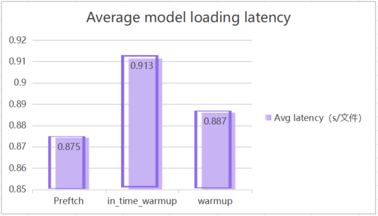
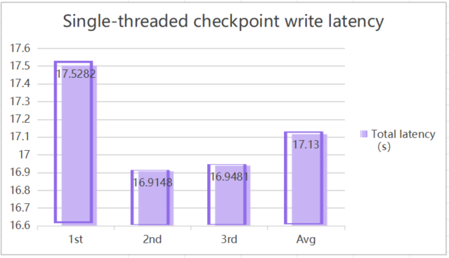
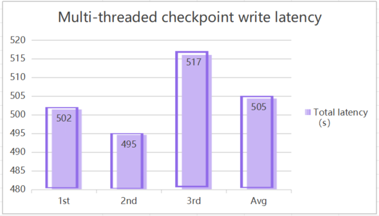
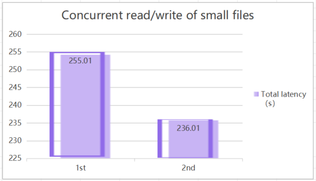

# What is DingoFS

## Introduction

[DingoFS](https://github.com/dingodb/dingofs) is an open source, cloud-native, high-performance distributed file system developed by [DataCanvas](https://www.datacanvas.com/), featuring elasticity, multi-cloud adaptability, multi-protocol compatibility, and high throughput. It leverages a multi-layer, multi-type, and high-speed distributed caching system to accelerate data I/O in AI workflows, effectively addressing burst I/O demands in AI scenarios. Additionally, it provides local caching capabilities to support full-lifecycle storage requirements for large AI models.

## Key Features

**1.POSIX Compliance**

Offers a local file system-like user experience to enable seamless system integration.

**2.AI-Native Architecture**

Deeply optimized for large language model (LLM) workflows, enabling efficient handling of massive training datasets and checkpoint workloads.

**3.S3 Protocol Compatibility**

Supports the standard S3 interface protocol for easy access to file system namespaces.

**4.Fully Distributed Architecture**

The Metadata Service (MDS), data storage layer, caching system, and client components all support linear scaling.

**5.Exceptional Performance**

Combines local SSD-level low latency with object storage-level high throughput, meeting the needs of both high-performance computing and large-capacity storage.

**6.Intelligent Cache Acceleration System**

Implements a 3-tier cache hierarchy (memory, local SSD, distributed cluster) with dynamic data path optimization to provide high-throughput, low-latency I/O acceleration for compute-intensive AI workloads.

**7.Intelligent multi-dimensional system monitoring**

Real-time performance metric collection and anomaly detection with alerting. Offers visual dashboards to aid in rapid troubleshooting. Includes proactive disk health monitoring to ensure system stability.

**8.Hot-Swappable Disks**

Allows replacement of faulty disks during system operation without service interruption.

**9.Cache Expiry & Eviction Mechanism**

Supports dynamic cache TTL configuration to prevent cold data from occupying cache storage, improving cache hit rates.

**10.Online Rolling Upgrades**

Enables seamless version upgrades without interrupting service. Includes robust rollback mechanisms to ensure business continuity and minimize upgrade risk.

## Main Technical Specification

**1.Large Model Inference - Model Loading Latency**

Using twenty 4GB files as a test dataset, system performance is benchmarked under three scenarios:
- Prefetch
- In-Time Warmup
- Warmup

Performance data under each of these conditions reflects DingoFS's ability to minimize latency during model loading for inference.

**2.Checkpoint Write Efficiency**

- Tested on a 9GB file in a single-threaded environment.

- In a multi-threaded environment, a total of 480G files were written, with an average file size of 2~3G.

**3.Concurrent test for reading and writing of many small files**

In this test, 5 million small files with a total size of 500 GB were written to DingoFS. The files were organized into multiple directories, with 10,000 files per directory. Subsequently, 8 threads were used to perform concurrent read operations on the dataset.

## Use Cases

**Enabling AI Model Training**

In AI/training scenarios, distributed file systems need to efficiently manage massive training data (e.g., images, text, audio, etc.) and provide high-throughput, low-latency access.DingoFS accelerates small-file reads and reduces data-processing den waiting time through optimized metadata management and data distribution strategies. Meanwhile, its POSIX-compatible interface significantly reduces the complexity of data preprocessing and loading.

**High Performance Computing (HPC)**

Distributed file systems provide highly aggregated bandwidth and low-latency access in scenarios where the return of computation results is critical. DingoFS improves read and write performance of large files through data sharding and parallel I/O optimization, and its elastic scalability dynamically adjusts storage resources with the size of the computing cluster to meet the high load demands of today's market.

**High-Frequency Data Analytics**

In use cases such as quantitative trading and risk modeling, DingoFS leverages in-memory caching to enable microsecond-level data access. It supports real-time processing of massive market datasets, ensuring zero-latency response for high-frequency trading systems.